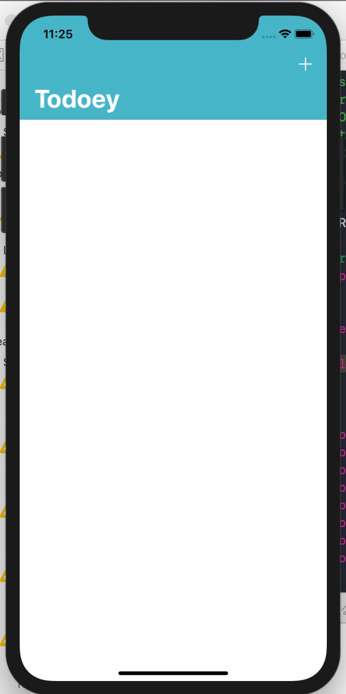
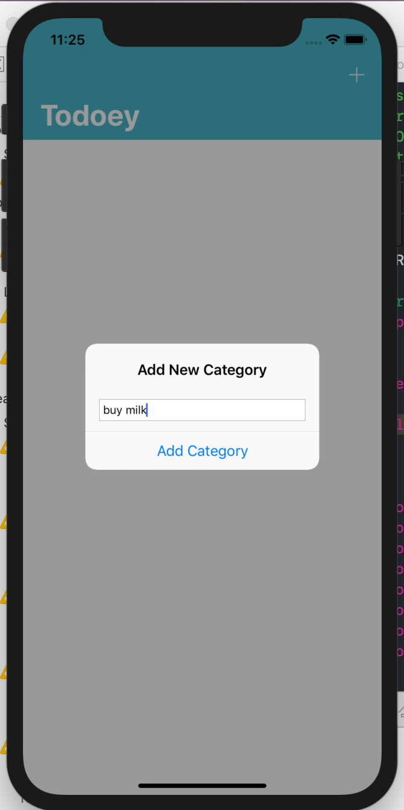
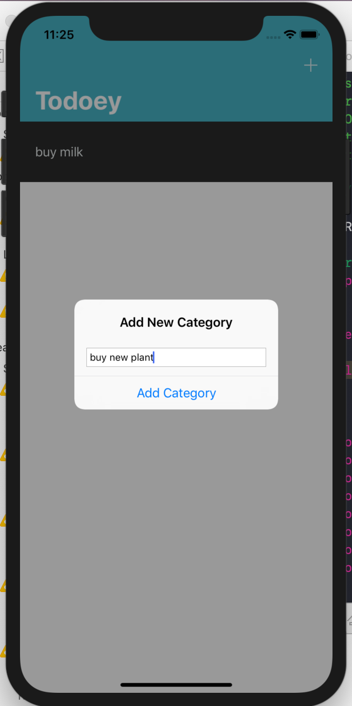
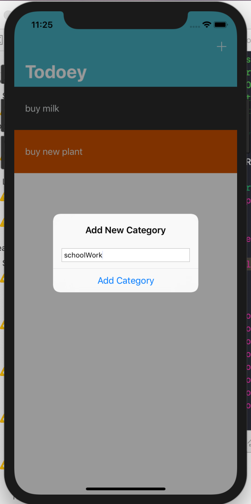
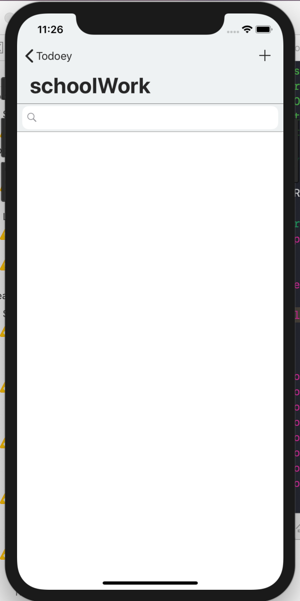
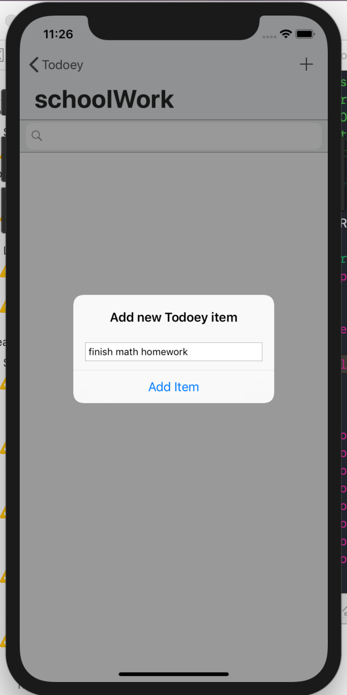
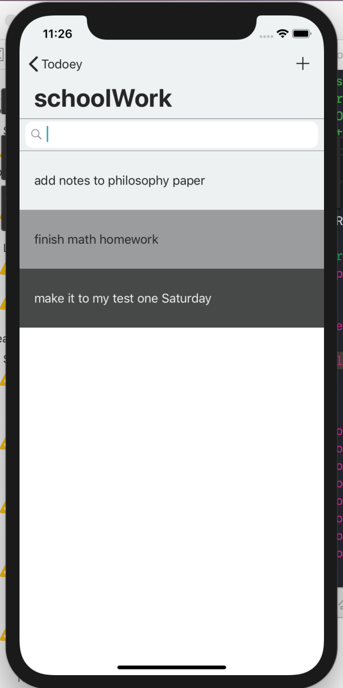

# Todoey

This is an iOS app built in Swift. It is meant to keep your to do list in check. Check out the color gradients :) 

Used a few cocoapods too, thanks to all contributors!
Using Realm for data persistance, and the chameleonFramework for the colors! 

